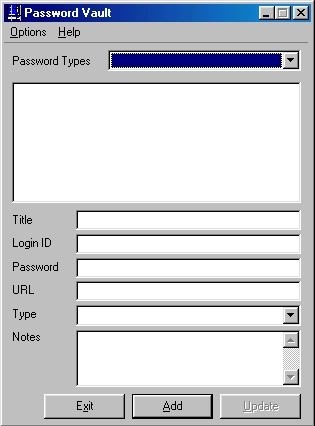



## Password Vault

### Description

Password Vault allows you to store your passwords in one easy place on YOUR computer...not some website out there on the web!
 
### More Info
 
This code is fairly well documented (uses DAO 3.6, sorry I'm working on the ADO version), registry entries, Access Database, SQL statements, HTML help file (with source), tray icon, etc.

I have had no side effects and I have been using this for over 1 year.

             |
---                |---
**Submitted On**   |2001-01-18 19:36:48
**By**             |[Deathmoon](https://github.com/Planet-Source-Code/PSCIndex/blob/master/ByAuthor/deathmoon.md)
**Level**          |Intermediate
**User Rating**    |4.4 (22 globes from 5 users)
**Compatibility**  |VB 6\.0
**Category**       |[Complete Applications](https://github.com/Planet-Source-Code/PSCIndex/blob/master/ByCategory/complete-applications__1-27.md)
**World**          |[Visual Basic](https://github.com/Planet-Source-Code/PSCIndex/blob/master/ByWorld/visual-basic.md)
**Archive File**   |[CODE\_UPLOAD139011182001\.zip](https://github.com/Planet-Source-Code/deathmoon-password-vault__1-14518/archive/master.zip)

### API Declarations

This did take me a while to make and I find it very useful...if you can think of any enhancements, etc. let me know...because I am working on a new version!

